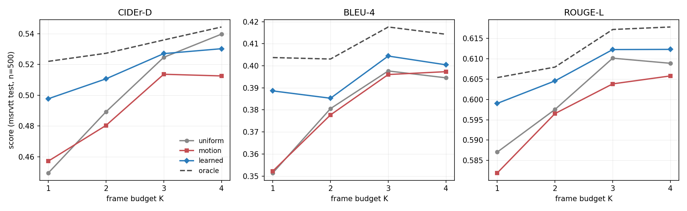
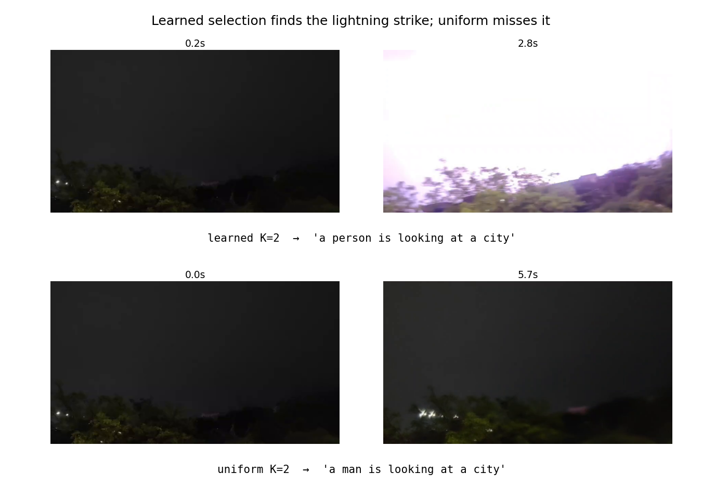

# VidCap-Adaptive — if you can only afford K frames, pick the right K

Video captioning under a frame budget. Nearly every captioning pipeline — research and production —
samples frames uniformly: every Nth frame, regardless of what is in them. This project trains a
lightweight **frame-relevance scorer** that picks the informative frames instead, and measures
whether that actually helps.

**It does. One learned frame beats two uniformly-spaced ones.**



## Headline result

MSR-VTT test, 500 clips, greedy decoding. CIDEr-D:

| K | uniform | motion | **learned** | oracle | learned − uniform | % of ceiling |
|---|---|---|---|---|---|---|
| 1 | 0.4495 | 0.4572 | **0.4977** | 0.5220 | **+0.0482** | **66%** |
| 2 | 0.4893 | 0.4804 | **0.5107** | 0.5273 | +0.0214 | 56% |
| 3 | 0.5246 | 0.5136 | **0.5270** | 0.5359 | +0.0024 | 21% |
| 4 | 0.5397 | 0.5125 | 0.5302 | 0.5443 | −0.0095 | — |

**learned K=1 (0.4977) > uniform K=2 (0.4893)** — a 2× cut in vision-encoder calls at equal
quality, recovering 66% of the oracle ceiling without ever seeing a caption at inference.

On **BLEU-4 and ROUGE-L the learned selector wins at every budget**. Only 1 of 12 metric-budget
cells is a loss (CIDEr at K=4, −0.0095) — and measured run-to-run noise between two independent
scorer trainings is ~0.007, so that loss is marginal, not decisive.

The four arms:
- **uniform** — evenly spaced frames. The industry default, and the thing to beat.
- **motion** — classical frame-to-frame change heuristic. A genuine null: it never meaningfully
  beats uniform and is clearly worse at K≥3.
- **learned** — this project's scorer.
- **oracle** — picks the K frames most similar to the *ground-truth caption*. Not a method; it
  reads the test answer. It exists to bound how much headroom selection could possibly have.

## Does it look at the video at all?

MSR-VTT captions are heavily prior-biased ("a man is talking…"), so a prefix-tuned LLM can score
respectably while ignoring the video entirely. Before any selection claim, the vision path was
controlled for: the same model with the video input severed scores **CIDEr 0.019 vs 0.311 sighted**.
The visual pathway is real, not decorative.

## On a real clip

Run on a handheld night clip of a lightning strike — completely outside MSR-VTT's distribution:



```
myclip.mp4  (35 candidate frames, 5.7s)
  learned  K=2  [0.2s, 2.8s]   'a person is looking at a city'
  uniform  K=2  [0.0s, 5.7s]   'a man is looking at a city'
```

The selector picks 2.8s — the exact frame the lightning fires. Uniform picks two dark frames and
misses the only event in the video. The *caption* is wrong (no person, no city): MSR-VTT is
daylight clips of people doing things, and a dark sky with a flash is far out of distribution.
Both halves of that are shown on purpose.

## How it works

```
video ─► ~3fps candidate pool ─► frozen SigLIP ─► cached embeddings
                                                        │
                                   ┌────────────────────┴────────────────────┐
                                   │  frame-relevance scorer → top-K         │   ← the contribution
                                   └────────────────────┬────────────────────┘
                                                        ▼
                               connector ─► projector ─► frozen Qwen2.5-1.5B (+LoRA) ─► caption
```

The vision encoder runs **once per video** at dataset-build time and the embeddings are cached, so
every training stage afterwards is cheap enough for a single T4. That 8.5 GPU-hour cache is the
asset the whole project is built on.

**Frame scoring.** A 0.72M-parameter network over a cached frame embedding, trained to predict
that frame's SigLIP similarity to the clip's ground-truth captions. Text is a *training signal
only* — at inference the scorer sees pixels alone, so there is no chicken-and-egg problem.
Selection is hard top-K, deliberately avoiding RL/Gumbel-softmax differentiable selection, which
is the standard way this idea burns weeks on instability instead of producing a result.

Val Spearman ≈ **0.51** against the held-out proxy target. It converges in one epoch and then
mildly overfits — `--epochs 3` is enough.

**Parameter budget** (measured):

| Component | Params | State |
|---|---|---|
| SigLIP so400m-384 | ~0.88B | frozen, never trained |
| Qwen2.5-1.5B-Instruct | 1.54B | frozen base |
| Connector (mean-pool, shipped) + projector | 61.95M | trained from scratch |
| Frame scorer | 0.72M | trained from scratch |
| LoRA r=8 (q,k,v,o × 28 layers) | 2.18M | Stage C, not yet run |

Mean-pool beat the temporal transformer on a controlled 500-clip run (val 3.393 vs 3.958) and
ships. Its known cost is temporal blindness — it averages the K frames, so ordering is not
expressible. The cross-attention resampler and temporal transformer remain in `model.py` as
ablation arms.

## Built from scratch vs. reused

**Reused, deliberately** — this is where competitive quality comes from, and it is how the field
actually works (LLaVA freezes both backbones; its contribution is the connector):
frozen SigLIP vision encoder, frozen Qwen2.5-1.5B decoder, PyTorch, OpenCV for decoding.

**Written from scratch:**
- the frame-relevance scorer and its supervision scheme (the headline contribution)
- LoRA, from raw tensor ops — not `peft`
- three connectors: mean-pool, cross-attention resampler, temporal transformer
- the multimodal fusion / prefix attention-masking scheme
- greedy and beam-search decoding
- the staged training recipe and every loss in it
- the full evaluation harness — budget curves, blind control, oracle ceiling
- BLEU-4, ROUGE-L and CIDEr-D, **validated to ~1e-11 against `pycocoevalcap`** so the numbers
  are comparable to published ones

## Run it

```bash
pip install -r requirements.txt
python3 -m scripts.caption yourclip.mp4 --k 2 --select learned,uniform
```

Runs on CPU (~1–2 min/clip; needs ~10 GB RAM for both models in fp32). Add `--select
learned,uniform,motion` to compare all three, `--beam 4` for better decoding.

Reproducing the numbers needs the cached embeddings and a GPU:

```bash
python3 -m scripts.build_cache --dataset msrvtt        # Stage 0, ~8.5 GPU-h
python3 -m scripts.train --stage B                     # connector + projector
python3 -m scripts.train_scorer --epochs 3             # Stage A, ~12 min
python3 -m scripts.evaluate --ckpt stageB --scorer scorer --oracle --budgets 1,2,3,4
python3 -m scripts.plot_curves out/eval_msrvtt_test.json figures/budget_curves.png
```

`./run_tests.sh` runs every gate, including the metric-equivalence check against `pycocoevalcap`.

## Limitations — read these

1. **The oracle is not achievable.** It reads the test caption. It is an upper bound on selection
   headroom, not a baseline anyone could deploy.
2. **Circularity.** The scorer is trained on SigLIP-to-caption similarity and the captioner
   consumes SigLIP embeddings, so the two are aligned by construction. Validation against human
   frame-importance labels (TVSum/SumMe) is the proper rebuttal and **has not been run yet**.
   This is the sharpest available criticism of the result and it is not yet answered.
3. **Noise floor ~0.007 CIDEr**, measured across two independent scorer trainings. Any claim
   resting on a gap under ~0.01 needs more seeds. The K=4 loss is inside that zone.
4. **MSR-VTT saturates at K=4.** 15-second single-shot clips are frame-redundant; four evenly
   spaced frames already give the model everything it can use. The result lives at K=1–2, and the
   originally-planned 2/4/8/16 sweep would have measured nothing at all.
5. **The shipped scorer is the last epoch, not the best.** Checkpointing overwrites each epoch, so
   the headline was produced by a slightly worse-than-best scorer — the result is *understated*.
6. **500 test clips, greedy decode.** Not the full 2,990-clip test split.

## Status

Done: embedding cache, connector training, blind control, oracle ceiling, frame scorer,
four-arm budget curves, end-to-end demo, video Q&A + summarization code.

Not done: TVSum/SumMe human-importance validation, Stage C LoRA, Q&A training (the code is written
and gate-tested but has never been trained), diversity-aware selection, connector/rank ablations.
