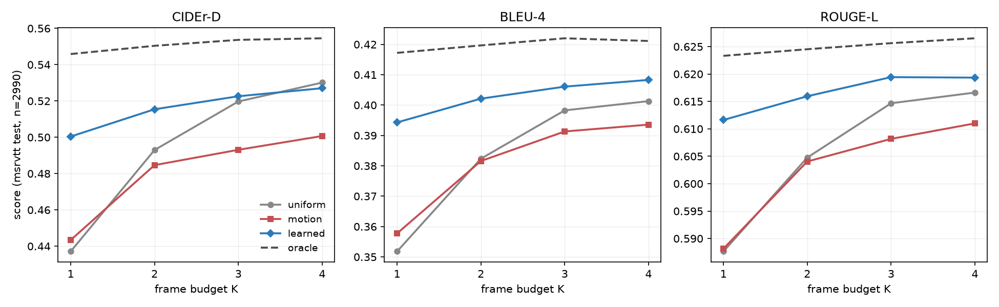
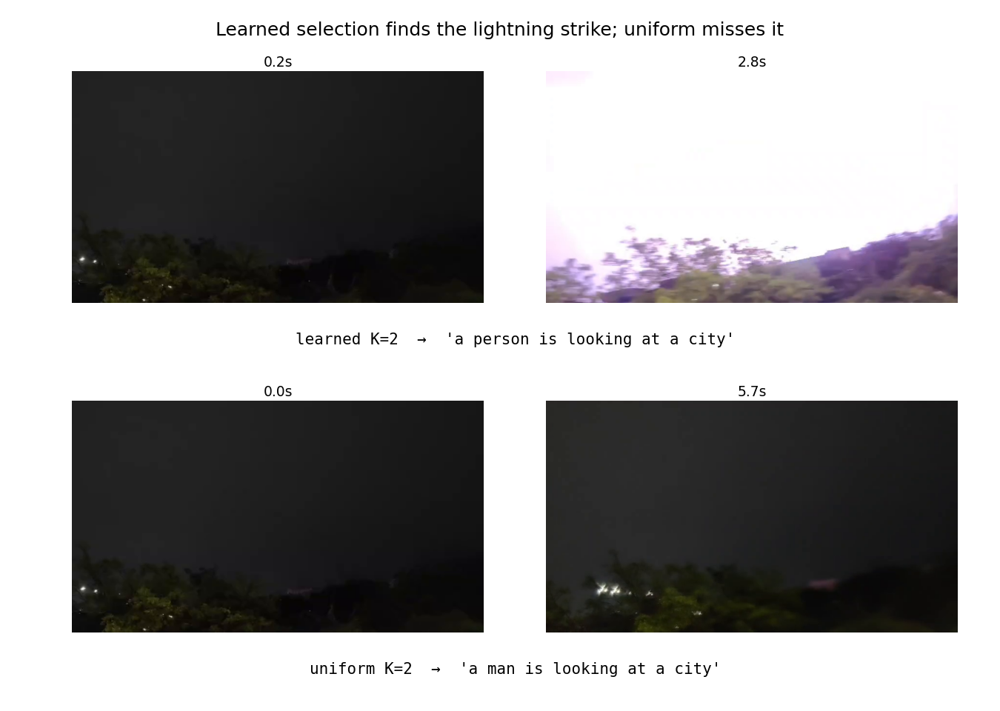
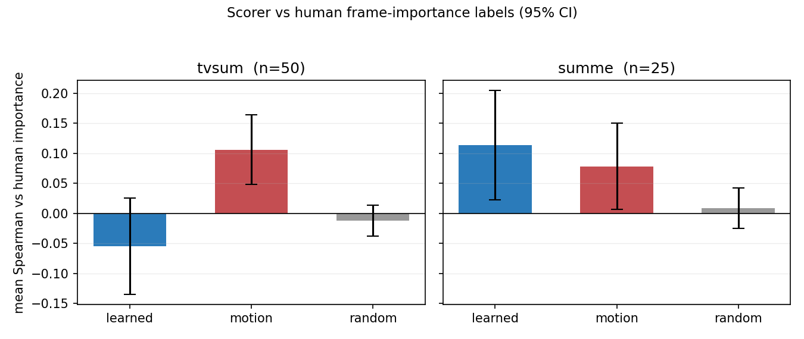

# VidCap-Adaptive — if you can only afford K frames, pick the right K

Video captioning under a frame budget. Nearly every captioning pipeline — research and production —
samples frames uniformly: every Nth frame, regardless of what is in them. This project trains a
lightweight **frame-relevance scorer** that picks the informative frames instead, and measures
whether that actually helps.

**It does. At a one-frame budget the learned choice lifts CIDEr-D by +0.063 (+14%), and one
learned frame is worth two uniformly-spaced ones.**



## Headline result

MSR-VTT test, **full 2,990-clip split**, greedy decoding. CIDEr-D:

| K | uniform | motion | **learned** | oracle | learned − uniform | % of ceiling |
|---|---|---|---|---|---|---|
| 1 | 0.4371 | 0.4434 | **0.5004** | 0.5459 | **+0.0633** | **58%** |
| 2 | 0.4930 | 0.4847 | **0.5154** | 0.5504 | +0.0225 | 39% |
| 3 | 0.5197 | 0.4931 | **0.5226** | 0.5537 | +0.0029 | 8% |
| 4 | 0.5301 | 0.5007 | 0.5270 | 0.5545 | −0.0031 | — |

The gain at K=1 is **+0.063 CIDEr-D, about 9× the measured noise floor**, recovering 58% of the
oracle ceiling without ever seeing a caption at inference.

**learned K=1 ≥ uniform K=2** on every metric: CIDEr-D 0.5004 vs 0.4930, BLEU-4 0.3943 vs 0.3823,
ROUGE-L 0.6116 vs 0.6048. On CIDEr that margin (+0.007) sits at the noise floor, so the defensible
reading is *one learned frame is worth two uniform ones*, not *clearly beats* them. On BLEU-4 the
margin is larger (+0.012).

An earlier 500-clip run gave the same shape (K=1: +0.048, 66% of ceiling; raw numbers in
[results/eval_msrvtt_test.json](results/eval_msrvtt_test.json)). The full split is the number to
cite: [results/eval_full_test.json](results/eval_full_test.json).

This is a claim about *information per frame*, not about wall-clock cost — see
[What this does NOT buy you](#what-this-does-not-buy-you-yet) before reading it as a speedup.

On **BLEU-4 and ROUGE-L the learned selector wins at every budget**. Only 1 of 12 metric-budget
cells is a loss (CIDEr at K=4, −0.0031) — and measured run-to-run noise between two independent
scorer trainings is ~0.007, so that loss is inside the noise: at K≥3 learned and uniform are tied
on CIDEr.

The four arms:
- **uniform** — evenly spaced frames. The industry default, and the thing to beat.
- **motion** — classical frame-to-frame change heuristic. A genuine null: it never meaningfully
  beats uniform and is clearly worse at K≥3.
- **learned** — this project's scorer.
- **oracle** — picks the K frames most similar to the *ground-truth caption*. Not a method; it
  reads the test answer. It exists to bound how much headroom selection could possibly have.

## Does it look at the video at all?

MSR-VTT captions are heavily prior-biased ("a man is talking…"), so a prefix-tuned LLM can score
respectably while ignoring the video entirely. Before any selection claim, the vision path was
controlled for: the same model with the video input severed scores **CIDEr 0.019 vs 0.311 sighted**.
The visual pathway is real, not decorative.

## On a real clip

Run on a handheld night clip of a lightning strike — completely outside MSR-VTT's distribution:



```
myclip.mp4  (35 candidate frames, 5.7s)
  learned  K=2  [0.2s, 2.8s]   'a person is looking at a city'
  uniform  K=2  [0.0s, 5.7s]   'a man is looking at a city'
```

The selector picks 2.8s — the exact frame the lightning fires. Uniform picks two dark frames and
misses the only event in the video. The *caption* is wrong (no person, no city): MSR-VTT is
daylight clips of people doing things, and a dark sky with a flash is far out of distribution.
Both halves of that are shown on purpose.

## Does it match what humans think is important? Partly — and this is the honest half

The obvious criticism of the result above: the scorer is trained on SigLIP-to-caption similarity
and the captioner consumes SigLIP embeddings, so the two are aligned by construction. To test it,
the scorer was run against **TVSum and SumMe** — video-summarisation datasets with per-frame
importance annotated by humans who never saw SigLIP.



Mean within-video Spearman, 95% CI. Paired per-video tests (same videos in every arm):

| dataset | n | learned | motion | random | learned − motion (paired) |
|---|---|---|---|---|---|
| TVSum | 50 | **−0.055** | +0.106 | −0.012 | **−0.161**, CI [−0.269, −0.052] — worse |
| SumMe | 25 | **+0.113** | +0.078 | +0.009 | +0.035, CI [−0.077, +0.147] — n.s. |

**`random` lands on zero in both**, so the harness is calibrated and the rest can be trusted.

**The honest summary: across both human-labelled datasets the scorer never demonstrably beats the
motion baseline.** It is significantly worse on TVSum and statistically tied on SumMe. It does beat
random on SumMe, but not on TVSum.

So the inversion is the real finding: **learned ≫ motion for caption quality, motion ≥ learned for
human importance.** The scorer is a *caption-relevance* predictor and is validated as one. It is
not a human-importance predictor, and this project measured both rather than assuming they
coincide. Nothing here weakens the MSR-VTT result — the blind control, oracle ceiling and budget
curves are independent of it — but it does bound what the scorer can be claimed to do.

Reproduce: `python3 -m scripts.validate_scorer --datasets tvsum,summe` (numbers in
[results/validate_scorer.json](results/validate_scorer.json)).

## Second task: video question answering

The same frozen backbones and the same selectors, retrained for **MSRVTT-QA** (one-word answers
to questions about the same clips). The connector is initialised from the captioning model and
trained for **1 epoch** on 149k questions; the loss covers only the answer, so the question
conditions generation rather than being a target. Nothing is re-embedded: QA reuses the
captioning cache.

Exact-match accuracy, 5,000 test questions sampled evenly across 2,962 of the 2,990 test videos,
greedy:

| K | uniform | motion | **learned** | learned − uniform |
|---|---|---|---|---|
| 1 | 0.3746 | 0.3724 | **0.3972** | **+0.0226** |
| 2 | 0.3960 | 0.3898 | **0.4016** | +0.0056 |
| 4 | 0.4074 | 0.4024 | 0.4018 | −0.0056 |

Always answering the most common answer ("man") scores **0.100**, so the model is answering
from the video, not the answer prior.

**The captioning pattern reproduces on a second task.** Learned selection helps most at K=1
(+2.3 points; the binomial standard error of one arm is ~0.7 points), is marginal at K=2 and
gone by K=4. Learned K=1 (0.397) again matches uniform K=2 (0.396). Motion is again no better
than uniform. The breakdown by question type is in
[results/evalqa_msrvtt_qa_test.json](results/evalqa_msrvtt_qa_test.json): at K=1 learned gains
most on *who* (0.502 vs 0.462) and *what* (0.331 vs 0.315).

Caveats: 1 epoch, one seed, 5,000 of 72,821 test questions, and no per-question pairing saved, so
the K=1 gap is suggestive-to-solid rather than a formal significance test. Published MSRVTT-QA
numbers use the full test set; this is not a comparison against them.

### Composed summaries — qualitative, and weaker than the numbers above

`scripts/summarize.py` writes the caption, then asks the QA model fixed probe questions (who /
where / what / how many) and keeps answers the caption does not already state. All 10 outputs
are in [results/summaries.txt](results/summaries.txt):

```
video7310  A man is dancing with a woman. Where: wedding. How many: three.
video8510  A man is walking with a dog. Where: street. How many: two.
video7610  A man is talking about the weight of a hammer. Where: place. What: text. How many: two.
```

The captions are reasonable and some facts add real information ("wedding", "street"). But
**"How many: two" appears in 9 of 10 summaries** — that is the answer prior, not counting — and
answers like "Where: place" carry nothing. MSR-VTT has no multi-sentence ground truth, so there is
no metric here. Treat it as a demo of composing the two models, not as a validated summariser.

## Watch a video: timeline, summary, questions

`scripts/watch.py` puts the pieces together for videos longer than one MSR-VTT clip:

```bash
python3 -m scripts.watch myvideo.mp4
```

1. **Scenes.** The SigLIP frame embeddings already computed for selection also find scene cuts:
   a jump in frame-to-frame distance well above the video's typical change. Scenes are kept to
   3–15 s, the clip length the captioner was trained on. On the 75 TVSum/SumMe videos this gives
   13–19 scenes for a ~3-minute video, median ~13 s each.
2. **Timeline.** Each scene is captioned from the frames the **learned selector** picks (K=2,
   where selection helps most), and repeated captions merge into one event.
3. **Summary.** The frozen Qwen2.5-1.5B-*Instruct* decoder, used as a plain text model, turns
   the timeline into a few sentences. No extra model, no extra training.
4. **Questions**, answered two ways, both shown:
   - *frames* — the Q&A adapter answers from the scene whose frames best match the question in
     SigLIP space. One-word answers, the MSRVTT-QA style it was trained on.
   - *timeline* — Qwen answers over the timeline, for "what happens after…" style questions.
     The time range is attached in code by matching the answer to its source caption, because
     the 1.5B model copies time ranges unreliably when asked to cite them.

The two tasks share one frozen Qwen and swap only the 62M adapter between captioning and Q&A, so
the whole thing fits in ~10 GB of RAM on a CPU.

What to expect — measured on hand-written timelines with the real Qwen2.5-1.5B: summaries are
faithful and in order, with occasional small embellishments ("dives *to prevent a goal*"); the
timeline answerer got 7 of 9 answerable questions right with the correct time, and said
"not in the video" to both unanswerable ones — but also to 2 answerable ones ("what happens at
the end?", "what does the goalkeeper do?"). That is a small hand check, not a benchmark. The summary can only be as specific as the captions, and MSR-VTT captions are
generic ("a man is talking").

### Measured on long videos: ActivityNet Captions — selection does not help here

300 ActivityNet Captions val videos (spread evenly; median ~2 min), each scored against its two
human-written reference paragraphs. Zero-shot: nothing was trained on ActivityNet. Same videos
and K=2 frames per segment in every arm. CIDEr-D (per-video, paired bootstrap 95% CIs):

| arm | CIDEr-D | BLEU-4 | ROUGE-L | words |
|---|---|---|---|---|
| fixed 15 s windows + uniform (naive) | 0.0712 | **0.0447** | **0.2277** | 49 |
| scenes + uniform | 0.0486 | 0.0391 | 0.2164 | 62 |
| scenes + motion | 0.0568 | 0.0389 | 0.2173 | 66 |
| scenes + **learned** | 0.0421 | 0.0402 | 0.2188 | 64 |
| scenes + oracle (ceiling) | 0.0635 | 0.0411 | 0.2215 | 63 |
| scenes + uniform → **Qwen summary** | 0.0710 | 0.0298 | 0.2054 | 44 |
| scenes + learned → **Qwen summary** | **0.0777** | 0.0302 | 0.2023 | 46 |

| comparison | Δ CIDEr-D | 95% CI | verdict |
|---|---|---|---|
| learned − uniform (scenes) | −0.0065 | [−0.0193, +0.0053] | no difference |
| learned − motion (scenes) | −0.0147 | [−0.0301, −0.0012] | learned slightly worse |
| oracle − uniform (scenes) | +0.0149 | [−0.0015, +0.0313] | even the ceiling barely helps |
| scenes − fixed windows (uniform) | −0.0226 | [−0.0389, −0.0068] | scene splitting hurts |
| summary − timeline (learned) | +0.0356 | [+0.0199, +0.0516] | summary clearly helps |
| summary − timeline (uniform) | +0.0224 | [+0.0065, +0.0389] | summary clearly helps |
| learned summary − fixed windows | +0.0065 | [−0.0142, +0.0275] | tied with naive |

**What this says, plainly:**

1. **Frame selection does not transfer to this setting.** Learned ≈ uniform, and learned is a
   little worse than motion. The oracle row explains why: even frames chosen by peeking at the
   reference text are not significantly better. Inside a 3–15 s scene sampled at 1 fps there are
   only ~10 candidate frames, and any 2 of them carry nearly the same content — the same
   saturation MSR-VTT shows at K≥3. Selection pays when a very small budget must be chosen from a
   large, varied pool (K=1 of a whole clip); per-scene selection removes exactly that condition.
2. **Scene splitting hurt against plain fixed windows.** It produced more, and more repetitive,
   sentences (62 vs 49 words; "a man is doing a back flip on a rock" five times in one video),
   and CIDEr/BLEU punish that. `merge_repeats` only merges *identical* adjacent captions.
3. **The Qwen summary is the one step that clearly helps**, lifting its timeline by +0.022 to
   +0.036 and bringing the scene pipeline back level with the naive baseline. It did not condense
   enough, though: ~5.5 sentences where it was asked for 2–4, against references of ~30–70 words.
4. **Absolute scores are low** because the captioner was trained only on MSR-VTT: its captions
   are generic, sometimes wrong ("a cat is running on a treadmill" for a cat climbing a wall), and
   never name the specific activity ActivityNet's references describe. Published paragraph
   captioners are trained on ActivityNet itself; these numbers are not comparable to them.

So the frame-selection claim stays where the evidence puts it: **one or two frames chosen from a
whole short clip**. The long-video pipeline works end to end and its summary step is measurably
useful, but choosing frames per scene added nothing. The natural fixes are a *global* budget
(pick K frames from the whole video, where sparse events can be missed by uniform sampling),
fewer and less repetitive scenes, and a tighter summary. Raw numbers:
[results/eval_activitynet_paragraphs.json](results/eval_activitynet_paragraphs.json).

### Whole-video budget: selection helps for one sentence, coverage wins for a paragraph

The per-scene null left one question: does selection help when a single budget must cover the
whole ~2-minute video, so it decides *which moments* get described at all? Same 300 videos; each
method picks K frames from the whole pool (at least half a uniform step apart, so a scorer cannot
spend everything on one burst); frames are captioned in time-ordered pairs, K/2 sentences.

| K | uniform | motion | **learned** | oracle | learned − uniform (95% CI) | oracle − uniform |
|---|---|---|---|---|---|---|
| 2 (1 sentence) | 0.0025 | 0.0051 | **0.0057** | 0.0080 | **+0.0032** [+0.0008, +0.0069] | +0.0055, sig. |
| 4 (2 sentences) | **0.0405** | 0.0283 | 0.0297 | 0.0428 | −0.0108 [−0.0199, −0.0025] | +0.0023, n.s. |
| 8 (4 sentences) | **0.1019** | 0.0939 | 0.1008 | 0.0938 | −0.0011 [−0.0193, +0.0170] | −0.0081, n.s. |

1. **At K=2 the MSR-VTT result reappears on long videos.** Learned beats uniform significantly
   and recovers **58% of the oracle headroom** — the same 58% as on the MSR-VTT test split. It
   does not beat motion here (+0.0006, n.s.), and the absolute scores are tiny because one
   8-word sentence is being scored against 30–70-word paragraphs.
2. **From K=4 up, uniform wins or ties — and so does the oracle's failure to beat it.** Even
   frames chosen by reading the references are no better than evenly spaced ones. The reason is
   what these selectors optimise: each scores frames by relevance to the video's captions *as a
   whole*, so they favour the video's most typical moments. A paragraph needs **coverage** — one
   sentence per event — and evenly spaced frames guarantee coverage. Relevance is the right
   objective for one sentence and the wrong one for four.
3. **The simplest long-video pipeline measured is also the best:** 8 evenly spaced frames,
   captioned in 4 pairs, scores **0.102** — above every scene-based arm, including the Qwen
   summary (0.078). Part of that is length: 27 words sit closer to the references than the scene
   timelines' 46–64, and CIDEr-D's length penalty rewards it.

So across every experiment the finding is consistent: **learned selection helps when a very
small budget produces a single description** — MSR-VTT K=1–2, MSRVTT-QA K=1, ActivityNet K=2 —
and **stops helping once the output has to cover several events**, where spreading frames out
matters more than picking the most relevant ones. A per-event oracle (using ActivityNet's
timestamps) and a coverage-aware selector are the natural next steps. Raw numbers:
[results/eval_activitynet_budget.json](results/eval_activitynet_budget.json).

## What this does NOT buy you (yet)

A lower frame budget is **not** a speedup in this implementation, and it is worth being precise
about why — measured, not argued:

1. **The decoder's cost is flat in K.** The shipped connector is mean-pool: it averages the K
   frames into one vector and the projector expands it to 8 prefix tokens regardless. Measured
   greedy decode at K=1/2/4/8: **4.73 / 4.53 / 4.49 / 4.56 s** — identical. Only the temporal
   connector would make the LLM's cost scale with K.
2. **Selecting 1 of N frames requires encoding all N.** The scorer consumes SigLIP embeddings, so
   picking the best frame from a 35-frame pool runs SigLIP 35 times. Uniform K=2 runs it twice.
   On a fresh video the learned path is currently *more* expensive, not less.

So the honest framing: **frame choice matters, and that is a claim about information content.**
Converting it into a compute saving needs **two-tier selection** — score the pool with a cheap
encoder (CLIP ViT-B/32 @224 is a fraction of SigLIP-so400m @384), then run the expensive encoder
only on the selected K. That is the natural next build, and the result above is the evidence it
would pay off. It is not implemented here.

Where the budget claim *is* already real: any setting where embeddings are computed once and
reused (archives, repeated queries over the same footage), the question is purely which frames to
keep — and there, fewer better frames is a direct win.

## How it works

```
video ─► ~3fps candidate pool ─► frozen SigLIP ─► cached embeddings
                                                        │
                                   ┌────────────────────┴────────────────────┐
                                   │  frame-relevance scorer → top-K         │   ← the contribution
                                   └────────────────────┬────────────────────┘
                                                        ▼
                               connector ─► projector ─► frozen Qwen2.5-1.5B (+LoRA) ─► caption
```

The vision encoder runs **once per video** at dataset-build time and the embeddings are cached, so
every training stage afterwards is cheap enough for a single T4. That 8.5 GPU-hour cache is the
asset the whole project is built on.

**Frame scoring.** A 0.72M-parameter network over a cached frame embedding, trained to predict
that frame's SigLIP similarity to the clip's ground-truth captions. Text is a *training signal
only* — at inference the scorer sees pixels alone, so there is no chicken-and-egg problem.
Selection is hard top-K, deliberately avoiding RL/Gumbel-softmax differentiable selection, which
is the standard way this idea burns weeks on instability instead of producing a result.

Val Spearman ≈ **0.51** against the held-out proxy target. It converges in one epoch and then
mildly overfits — `--epochs 3` is enough.

**Parameter budget** (measured):

| Component | Params | State |
|---|---|---|
| SigLIP so400m-384 | ~0.88B | frozen, never trained |
| Qwen2.5-1.5B-Instruct | 1.54B | frozen base |
| Connector (mean-pool, shipped) + projector | 61.95M | trained from scratch |
| Frame scorer | 0.72M | trained from scratch |
| LoRA r=8 (q,k,v,o × 28 layers) | 2.18M | Stage C, not yet run |

Mean-pool beat the temporal transformer on a controlled 500-clip run (val 3.393 vs 3.958) and
ships. Its known cost is temporal blindness — it averages the K frames, so ordering is not
expressible. The cross-attention resampler and temporal transformer remain in `model.py` as
ablation arms.

## Built from scratch vs. reused

**Reused, deliberately** — this is where competitive quality comes from, and it is how the field
actually works (LLaVA freezes both backbones; its contribution is the connector):
frozen SigLIP vision encoder, frozen Qwen2.5-1.5B decoder, PyTorch, OpenCV for decoding.

**Written from scratch:**
- the frame-relevance scorer and its supervision scheme (the headline contribution)
- LoRA, from raw tensor ops — not `peft`
- three connectors: mean-pool, cross-attention resampler, temporal transformer
- the multimodal fusion / prefix attention-masking scheme
- greedy and beam-search decoding
- the staged training recipe and every loss in it
- the full evaluation harness — budget curves, blind control, oracle ceiling
- BLEU-4, ROUGE-L and CIDEr-D, **validated to ~1e-11 against `pycocoevalcap`** so the numbers
  are comparable to published ones

## Run it

```bash
pip install -r requirements.txt
python3 -m scripts.caption yourclip.mp4 --k 2 --select learned,uniform
python3 -m scripts.watch yourvideo.mp4 --ask "what is the man holding?" --json out.json
```

Runs on CPU with ~10 GB RAM. `caption` takes ~1–2 min/clip. `watch` is slower: SigLIP costs
~3 s/frame on CPU and the pool is capped at 128 frames (`--max-frames`), so a 30 s video takes
a few minutes and a long one up to ~10. Needs `out/checkpoints/stageB.pt` and `scorer.pt`;
`qaB.pt` adds the frame-based answers. Add `--select learned,uniform,motion` to `caption` to
compare selectors, `--beam 4` for better decoding.

Reproducing the numbers needs the cached embeddings and a GPU:

```bash
python3 -m scripts.build_cache --dataset msrvtt        # Stage 0, ~8.5 GPU-h
python3 -m scripts.train --stage B                     # connector + projector
python3 -m scripts.train_scorer --epochs 3             # Stage A, ~12 min
python3 -m scripts.evaluate --ckpt stageB --scorer scorer --oracle --budgets 1,2,3,4
python3 -m scripts.plot_curves out/eval_msrvtt_test.json figures/budget_curves.png   # no --limit: full split
```

`./run_tests.sh` runs every gate, including the metric-equivalence check against `pycocoevalcap`.

## Limitations — read these

1. **The oracle is not achievable.** It reads the test caption. It is an upper bound on selection
   headroom, not a baseline anyone could deploy.
2. **Circularity — tested, and only partly answered.** The scorer and the captioner share a
   representation, so their agreement is partly by construction. The TVSum/SumMe run above is the
   check, and it does not clear the scorer: it never demonstrably beats a motion baseline on
   human labels. The captioning result stands on its own evidence, but "the scorer finds the
   frames humans consider important" is **not** a claim this project supports.
3. **Noise floor ~0.007 CIDEr**, measured across two independent scorer trainings. Any claim
   resting on a gap under ~0.01 needs more seeds. The K=4 loss and the CIDEr margin of learned
   K=1 over uniform K=2 are both inside that zone.
4. **MSR-VTT saturates at K=4.** 15-second single-shot clips are frame-redundant; four evenly
   spaced frames already give the model everything it can use. The result lives at K=1–2, and the
   originally-planned 2/4/8/16 sweep would have measured nothing at all.
5. **The shipped scorer is the last epoch, not the best.** Checkpointing overwrites each epoch, so
   the headline was produced by a slightly worse-than-best scorer — the result is *understated*.
6. **Greedy decode, one scorer seed.** The headline uses the full 2,990-clip test split, but
   published MSR-VTT numbers usually use beam search, and this is not a comparison against them.

## Status

Done: embedding cache, connector training, blind control, oracle ceiling, frame scorer, four-arm
budget curves on the full test split, TVSum/SumMe human-importance validation, video Q&A (1 epoch,
three-selector comparison), composed summaries, end-to-end demo, `watch` (scene timeline,
summary and two-source Q&A for longer videos), ActivityNet paragraph evaluation (300 videos,
7 arms — selection did not help per scene; the summary step did), whole-video budget (learned helps at K=2, uniform wins at K≥4 where coverage matters).

Not done: Stage C LoRA; diversity-aware selection; connector and LoRA-rank ablations; beam-search
evaluation; multi-seed runs. None are load-bearing for the results above.
